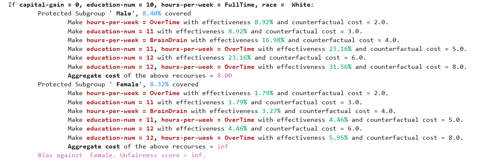

# Fairness Aware Counterfactuals for Subgroups

This repository is the implementation of the paper Fairness Aware Counterfactuals for Subgroups (FACTS). FACTS is a framework for auditing subgroup fairness through counterfactual explanations. We aim to (a) formulate different aspects of the difficulty of individuals in certain subgroups to achieve recourse, i.e. receive the desired outcome, either at the micro level, considering members of the subgroup individually, or at the macro level, considering the subgroup as a whole, and (b) introduce notions of subgroup fairness that are robust, if not totally oblivious, to the cost of achieving recourse. Below, appears a subgroup audited by one of our fairness metrics.  



In our work, we call the above representation "Comparative Subgroup Counterfactuals". These if-then rules, along with the effectiveness that each action manages to achieve (micro or micro, see Section 2.2 of our paper) give, in our opinion, a very clear and intuitive insight into certain type of bias that a machine learning model may exhibit.

## Requirements

All experiments were run on the [Anaconda](https://www.anaconda.com/) platform using python version 3.9.16. Creating a conda environment is generally recommended to avoid package version collisions. You can do that with:

```setup
conda create --name facts
```

and then activate it with

```setup
conda activate facts
```

 To install requirements:

```setup
conda install -c conda-forge numpy pandas scikit-learn matplotlib mlxtend omnixai xgboost notebook
```

Optional Dependency on IBM Fairness 360 if you would like to run on the exact same "COMPAS" dataset as we did:

```setup
conda install -c conda-forge aif360
```


## Model Training

A model is needed for auditing purposes. We trained, in our paper, a logistic regression classifier. Any other classification model could be used.

Specifically, our method expects a model with the form of `facts.models.ModelAPI`, which means simply any python object with a `predict` method which takes as input a DataFrame containing the dataset and outputs a 1-dimensional prediction array of 0s and 1s.


## Pre-trained Models / Pre-computed results

In the scope of precomputed results, we provide:
- full sets of precomputed rules for each dataset (with a frequent itemset minimum support of 1%).
- only for the Adult dataset with 'race' as the protected attribute, we have also provided a file which, in addition to the rules, contains the actual model and the test data we used, which are the main inputs required by our framework. Note: for reading this file correctly, you will probably need to have `scikit-learn` version 1.0.2 installed.
- finally, all experiments we ran use 131313 as the value of the random_state parameter, wherever applicable (notice that, for example, the `LogisticRegression` model with default parameters is deterministic).

The above assets can be found in the directory [Pre-computed Results](facts/Pre-computed%20Results). The commands required to read them are displayed in the Jupyter notebooks we provide (more on this in the following sections).

## Results

We provide our main experimental results, together with the code that produces them, in the Jupyter notebooks located in the [Notebooks](facts/Notebooks) directory.

For each case study we have two notebooks. One that shows how our framework can be used for the generation of a large set of candidate counterfactuals, and another which showcases how one can get aggregate statistics of the raw results.

Specifically, for the calculation of the ground set of candidate counterfactuals we have the following notebooks:
- [Adult sex](facts/Notebooks/Adult/AdultDataset_sex.ipynb)
- [Adult race](facts/Notebooks/Adult/AdultDataset_race.ipynb)
- [COMPAS](facts/Notebooks/COMPAS/CompasDataset.ipynb)
- [SSL](facts/Notebooks/SSL/SSLDataset.ipynb)
- [Ad Campaign](facts/Notebooks/AdCampaing/Ad%20Campaign%20Dataset.ipynb)

and the following notebooks include with the aggregate ranking statistics:
- [Adult sex](facts/Notebooks/Adult/Adult-sex-Experiments.ipynb)
- [Adult race](facts/Notebooks/Adult/Adult_race-Experiments.ipynb)
- [COMPAS](facts/Notebooks/COMPAS/Compas-Experiments.ipynb)
- [SSL](facts/Notebooks/SSL/SSL-Experiments.ipynb)
- [Ad Campaign](facts/Notebooks/AdCampaing/AdCampaing-Experiments.ipynb)

The respective results can be seen in our paper, in the Appendices C and D. More specifically:
- For the Adult dataset with the sex as protected attribute, we show some Comparative Subgroup Counterfactuals in the main part of the paper, in Figures 2 and 3. We show some aggregate statistics in Tables 1 and 10.
- For the Adult dataset with the race as protected attribute, we show in Appendix C.1, CSCs in Figure 4 and aggregate statistics in Tables 6 and and 10.
- For the COMPAS dataset (with race as the protected attribute), CSCs are shown in Figure 5 and some ranking statistics in Table 7.
- For the SSL dataset, CSCs are shown in Figure 6 and some ranking statistics in Table 8.
- For the Ad Campaign dataset, CSCs are shown in Figure 7 and some ranking statistics in Table 9

Both notebooks, for each dataset, also contain a series of examples on the generation of Comparative Subgroup Counterfactuals, which is a central representation of the output of our method.


